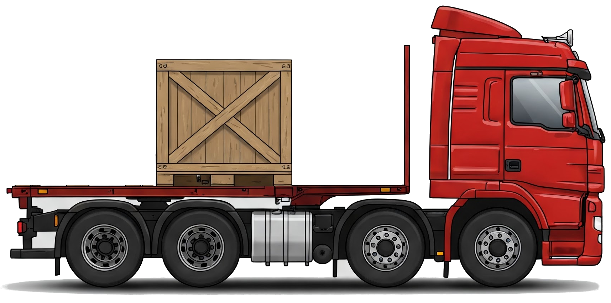

# Google Distributed Cloud — VM Disk Exporter
<p align="left"></p>
Export Virtual Machine Disks from Google Distributed Cloud Connected 

## Overview

This VM Disk Exporter container image and it's associated Pod definition provide for an easy way to export [VMRuntime](https://cloud.google.com/kubernetes-engine/distributed-cloud/bare-metal/docs/vm-runtime/overview) persistent volumes from GDC to an out-of-cluster destination of your choosing. 

VMRuntime has not implemented the KubeVirt [Export API](https://kubevirt.io/user-guide/storage/export_api/), and no other straightforward mechanism for exporting a `VirtualMachineDisk` is generally available.

This solution uses the [QEMU Disk Network Block Device Server](https://www.qemu.org/docs/master/tools/qemu-nbd.html) to safely access a given `VirtualMachineDisk` persistent volume, copy the data from the QEMU disk image and send it across the network using Rclone to any [rclone supported storage destination](https://rclone.org/overview/).

## Setup
- Clone this repository: `git clone https://github.com/Ben-Chapman/Living-on-the-Edge.git`
- For the remainder of this setup, we'll be working from the `vm-disk-exporter` directory
  - `cd Living-on-the-Edge/vm-disk-exporter`
- Build the vm-disk-exporter container image
  - `docker build -t <tag> ./container`
- Push the container image to an image registry of your choosing. For example:
  - `docker push us-central1-docker.pkg.dev/<gcp project>/<artifact registry repo>/<container name:tag>`
- Edit the Kustomize [kustomization.yaml](kustomization.yaml) file.
  - All configuration items which need to be modified are exposed through Kustomize, so there should be no need to directly edit the Pod manifest file for this application.
  - Comments have been added throughout the Kustomization file, guiding you on what values to change.
- Edit the [rclone.conf.yaml](rclone.conf.yaml) `ConfigMap`
  - This `ConfigMap` should contain a **valid** and tested Rclone configuration file. If needed, follow the Rclone [Configuration documentation](https://rclone.org/docs/#configure) to setup a new Rclone remote destination, and then copy the resulting rclone config into this `ConfigMap`. If needed you can use the previously built container image to configure a Rclone destination:
```
docker run -it --rm --entrypoint bash <imagename:tag>

09e983e6db9c:~# rclone config
2025/02/18 17:14:57 NOTICE: Config file "/root/.config/rclone/rclone.conf" not found - using defaults
No remotes found, make a new one?
n) New remote
s) Set configuration password
q) Quit config
n/s/q>
```
- At this point, the configuration has been completed. You can view the resulting Kubernetes manifests by running a `kustomize build` command.


## Running the VM Disk Exporter
- To run the VM Disk Exporter on your GDC Connected cluster, you can simply `kubectl apply -k .` To monitor the deployment progress: `kubectl get pod vm-disk-exporter -n <namespace>`
- Once the vm-disk-exporter Pod is in a Running state, you can exec into the running Pod to kick off the disk export command.
-   `kubectl exec -it vm-disk-exporter -n <namespace> -- bash`
-   Once at a shell within the `vm-disk-exporter` Pod you can simply run `./vm-disk-export.sh`. This helper script will provide some information around the PersistentVolume that you are attempting to export, and wait for confirmation before progressing.
-   At the completion of an export, a brief summary will be provided. If all was successful, you now have a raw QEMU image stored within your Rclone destination.

## Advanced Functionality
### Create a QEMU sparse image export
- The disk images generated by the `vm-disk-export.sh` helper script are QEMU [RAW disk images](https://qemu-project.gitlab.io/qemu/system/images.html#cmdoption-image-formats-arg-raw), which are the exact size of your VM's disk. So if your virtual machine has a drive of 30 GiB, the resulting disk image file will *also* be 30 GiB in size. Oftentimes, you can generate a much smaller QEMU disk image file by converting the existing RAW disk image, into a qcow2-format sparse disk image, which omits file blocks that contain all zeroes (no data). If you have a 30 GiB RAW disk image, but only 15 GiB is being used the resulting qcow2 disk image will be 15 GiB in size.
Generation of a sparse disk image requires that you convert the existing raw-format persistent volume to a qcow2-formatted disk image:
  - `qemu-img convert -p -O qcow2 /dev/vmdisk /disk-image-name.qcow2`
- The resulting `disk-image-name.qcow2` disk image now lives on the ephemeral storage within the Pod. From here, you can use standard Rclone commands (or `rsync`, or `scp`, etc) to copy that qcow2 disk image out of the cluster.

### Explore the remote destination with Rclone
- The `rclone` cli is installed within the vm-disk-exporter container image, and your rclone.conf configuration file is mounted into this container. You should be able to use any [supported `rclone` command](https://rclone.org/docs/) to interact with your remote destination:
  - `rclone lsl $RCLONE_REMOTE_PATH`
  - `rclone size $RCLONE_REMOTE_PATH/disk-image-name.raw`

### Automatically exporting a VM Disk
- Once you're comfortable with the configuration of the VM Disk Exporter, you can modify the `spec.containers.command` value in [vm-disk-exporter.yaml](vm-disk-exporter.yaml) to `command: ["yes", "|", "./vm-disk-exporter.sh", ";", "sleep", "infinity"]` and (re)deploy the vm-disk-exporter Pod. A better solution would be to update the [vm-disk-export.sh](container/files/vm-disk-export.sh) helper script to automatically kick off a VM Disk export, perhaps with a few additional sanity checks before doing so.
  
## FAQ
- Is this a backup solution?
  - Absolutely not. There are far better ways to backup the data within a virtual machine. This is provided as a solution to export the entire VM disk, perhaps to copy a VM to another GDC cluster or your local workstation.
    
- Do I need to shut down my VM before exporting it's disk?
  - In almost all cases, yes. The VM Disk Exporter does not take any sort of PV snapshot before mounting the PVC into the vm-disk-exporter Pod, so to ensure consistent and reliable VM disk exports shut down the virtual machine before performing an export.
    
- What destinations can I export my VM Disk to?
  - Practically any destination that `rclone` [supports](https://rclone.org/overview/). This includes Google Cloud Storage, Amazon S3, Minio, SFTP, SMB, etc. Additionally, `openssh` and `rsync` are included in the container image, so you can `scp` or `rsync` to any supported destination.
